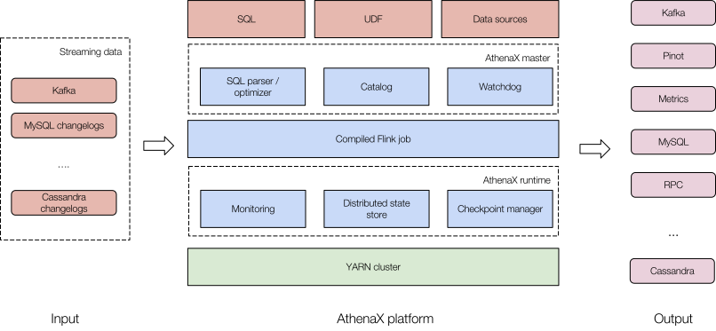

# Design

## Overview

***

The above figure describes the overall architecture of AthenaX. AthenaX consists of two major components. The first one is AthenaX master, which manages the full lifecycles of the jobs. The second one is the catalogs and connectors, which describe how AthenaX jobs should interact with the external world.

To run an AthenaX job, first the user submits an AthenaX job through the [REST APIs](https://github.com/uber/AthenaX/blob/master/athenax-backend/src/main/resources/athenax-backend-api.yaml). Then the AthenaX master compiles the job to a native Flink application and then deploys it to the desired cluster. After the deployment, the AthenaX master monitors the status of the job continuously and recovers it in case of failures.

## Design considerations

We are going to use the following terminologies in the subsections:

* *Job*. A job describes a streaming analytic application. It consists of the SQL, the clusters that the job should be run upon, and the amount of resources (i.e., memory and CPU cores) that are required by the job.
* *Catalog*. A catalog describes how to translate a table in the SQL to a data source or data sink.
* *Cluster*. A cluster is a YARN cluster that is capable of running AthenaX job.
* *Instance*. An instance is a Flink application running on top of a specific cluster that is realized from a specific AthenaX job. AthenaX compiles a job down to a Flink job and realizes it on a specific cluster.

### Plugging in catalogs and connectors

We found that it is essential to allow users to plug in their own catalogs and connectors. Recall that catalogs specify how to map a table in SQL to data sources or data sinks. Connectors specify how AthenaX should interact with external systems (e.g., publishing to a Kafka topic or making RPCs calls)

User-defined catalogs must implement [AthenaXTableCatalogProvider]( https://github.com/uber/AthenaX/blob/master/athenax-vm-api/src/main/java/com/uber/athenax/vm/api/AthenaXTableCatalogProvider.java). The connectors must implement [DataSinkProvider](https://github.com/uber/AthenaX/blob/master/athenax-vm-api/src/main/java/com/uber/athenax/vm/api/DataSinkProvider.java) if it provides a data sink, or [TableSourceConverter](https://github.com/apache/flink/blob/master/flink-libraries/flink-table/src/main/scala/org/apache/flink/table/catalog/TableSourceConverter.scala) if it provides data sources. Please see the [Kafka-JSON connector](https://github.com/uber/AthenaX/tree/master/athenax-vm-connectors/athenax-vm-connector-kafka) for more details.

### Compiling AthenaX jobs to Flink applications

To execute the AthenaX jobs efficiently, Athenax compiles them to native Flink applications using the Flink's [Table and SQL APIs](https://ci.apache.org/projects/flink/flink-docs-release-1.3/dev/table/index.html). On a very high level, AthenaX combines the catalogs and the parameters (e.g., parallelism) with the SQL specified the job and compiles it to a Flink application, which is represented as a [JobGraph](https://ci.apache.org/projects/flink/flink-docs-release-1.3/internals/job_scheduling.html) in Flink.

AthenaX supports SQL with user-defined functions. Users can specify additional JARs to be loaded along with the SQL. To compile them safely, AthenaX compiles the SQL in a dedicated [process](https://github.com/uber/AthenaX/blob/master/athenax-vm-compiler/src/main/java/com/uber/athenax/vm/compiler/executor/ContainedExecutor.java). However, the functionality, particularly localizing the UDF jar, has not been fully implemented in the current version.

### Managing job instances

AthenaX abstracts the running status of the jobs using two state. The first one is desired state, which describes the clusters and the resources that the job should start with. The second is actual state, which contains the same information but for all realized instances for the particular job.

The [watchdog](https://github.com/uber/AthenaX/blob/master/athenax-backend/src/main/java/com/uber/athenax/backend/server/jobs/WatchdogPolicy.java) periodically computes actual states and compares them with the desired states. The AthenaX master can start or kill the corresponding YARN applications based on the differences. In this case starting a new job is just a concrete case of recovering a failed job. Auto scaling is also handled similarly.

One thing worth noting is that all the actual states are "soft states", that is, they can be recovered through scanning the YARN clusters. The design allows the AthenaX master to be run in multiple availability zones provided that (1) the underlying persistent data store is available in the deployed available zones, and (2) the watchdog is aware of active master in multiple availability zones.
